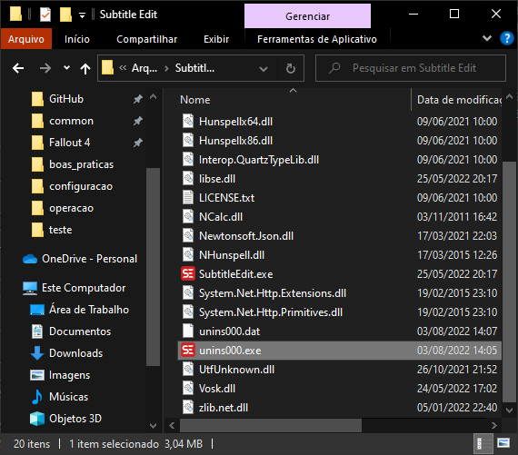
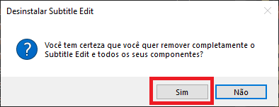
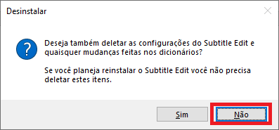

# Manual de atualização
É muito simples atualizar o Subtitle Edit e não é necessário configurá-lo de novo.

0. Tenha certeza que o programa está fechado antes de prosseguir.

1. Desinstale o programa pelo painel de controle ou pelo `Adicionar ou remover programas`, ou mesmo dentro da pasta onde o programa foi instalado existe um arquivo chamado `unins000.exe`.

2. Ao rodar o programa selecione `Sim` caso o seu Sistema Operacional peça permissão para executar o arquivo.

3. O desinstalador irá perguntar se você quer remover completamente o Subtitle Edit, selecione `Sim`.

4. O desinstalador também perguntará se você quer se livrar das configurações do subtitle, e quaisquer mudanças feitas nos dicionários. Aqui se você apenas estiver atualizando recomendo que diga `Não`. Caso esteja querendo resolver algum problema com dicionários ou configurações aí talvez seja o outro caso. Para atualizar apenas selecione `Não`.

5. Agora basta seguir o manual de instalação baixando uma versão mais recente.
 