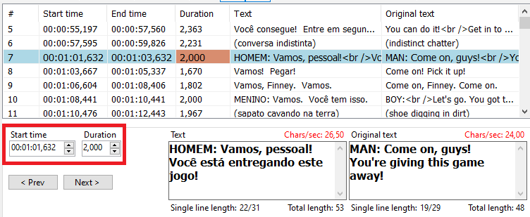
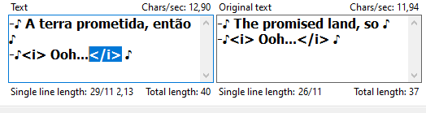

# Boas práticas
## Revisão de legendas
 
- Não se deve usar palavrões, substituir sempre.

- As traduções não podem ser literais, tem que fazer sentido com o conteúdo.

- Ao encontrar problemas de sincronia, sempre ajustar de acordo com o time in-out localizado no canto esquerdo da tela.

- Sempre que houver as tags `</i>` no início ou final de frases, elas devem ser removidas.

- Quando não souber alguma gíria ou expressão sugere-se que se pesquise no google da seguinte forma, `Meaning "sua dúvida"`, `Slang "sua dúvida"`, `Expression "sua dúvida"`.

- Quando alguém fora da cena está falando é necessário que se acrescente o nome da pessoa entre colchetes para indicar quem está falando naquele momento `[nome da pessoa]`.

- Sempre indique a linguagem ao qual está traduzida seu arquivo, acrescente um `_pt` ao final por exemplo para português.
