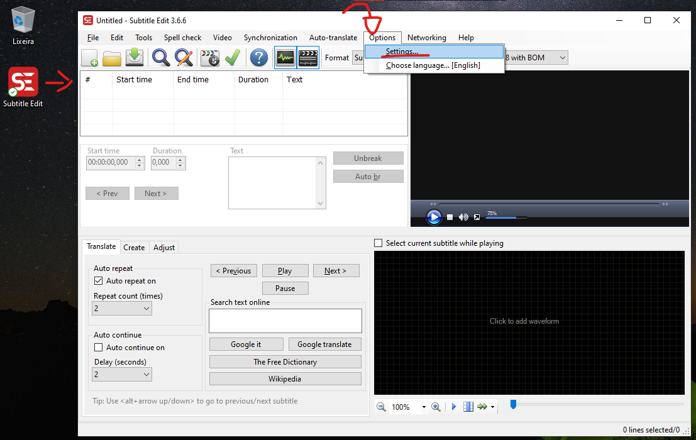
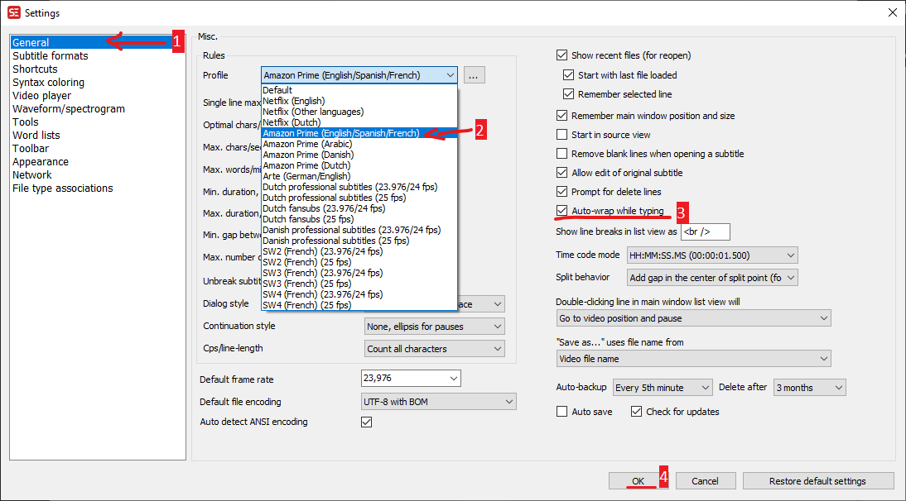
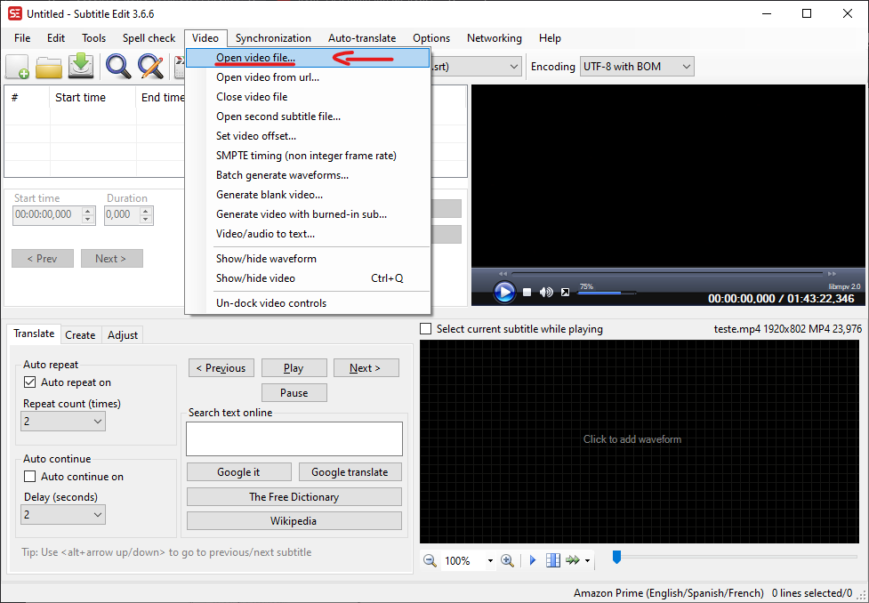
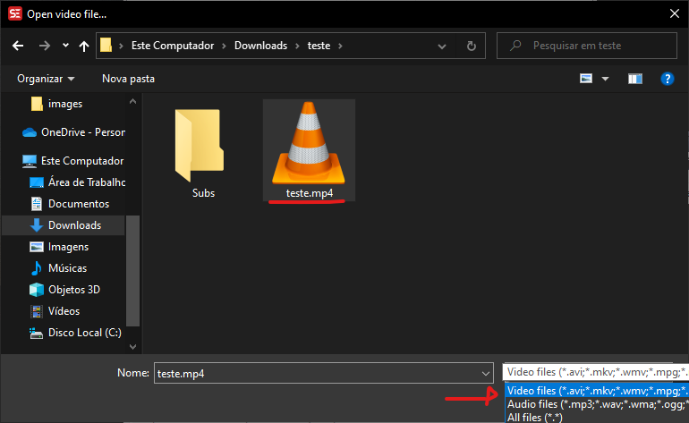
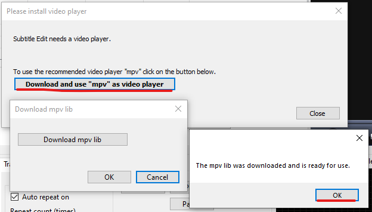
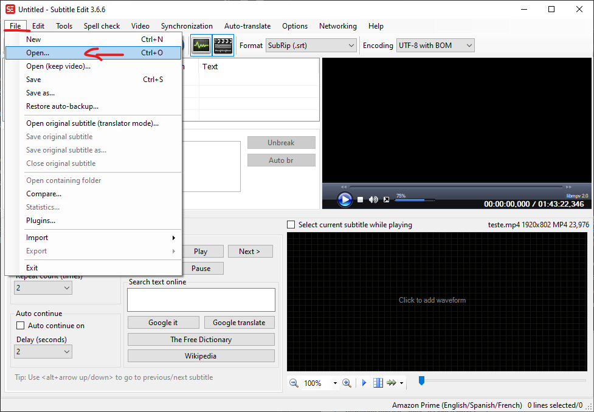
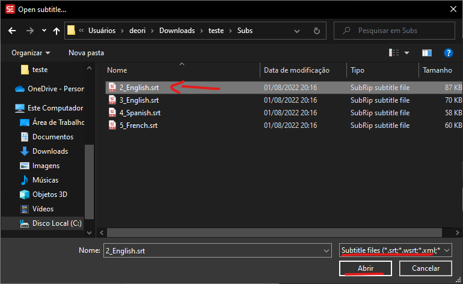
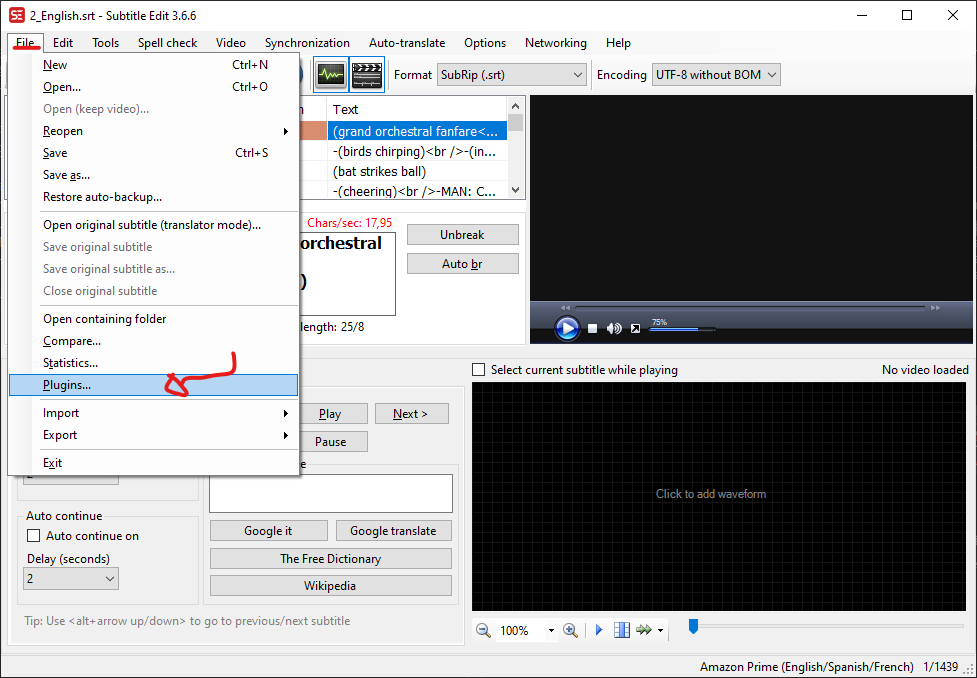
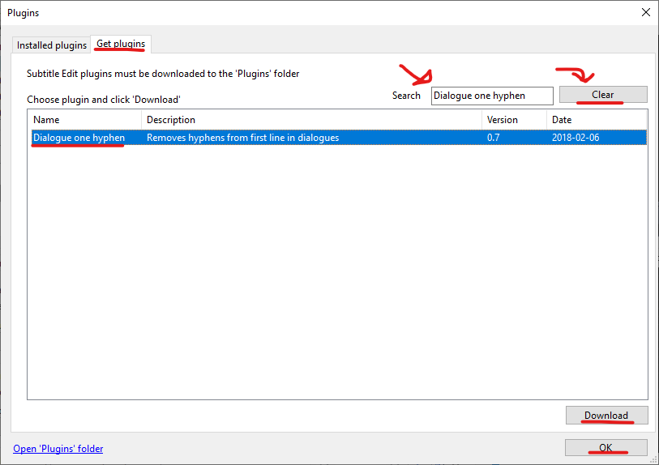
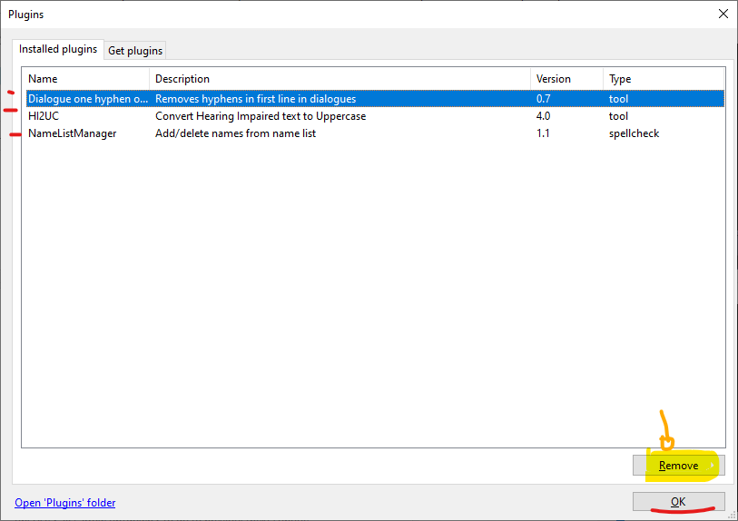

# Primeira configuração Subtitle - Edit
## Exemplo configuração com preset Amazon Prime
1. Ao abrir o programa pela primeira vez vá direto na aba `Options`, depois clique em `Settings`:

2. Feito isso irá abrir uma janela com diversas opções em uma lista a esquerda, clique em `1-General` depois selecione na lista `2-Amazon Prime (English/Spanish/French)`, recomendo também que selecione `3-Auto-wrap while typing` para o programa ir ajustando a linha enquanto o usuário digita, e depois basta clicar em `4-OK`:

## Inserindo vídeo e legenda pela primeira vez
1. A primeira coisa a se fazer antes de começar de fato a traduzir é inserir um vídeo. Para fazer isso basta clicar em `Video` depois em `Open Video File`.

2. Agora basta selecionar um o vídeo ao qual queira sincronizar as legendas para editar. Caso o arquivo que queira editar não apareça, você pode tentar mudar a extensão de `Video Files` para `All Files`.
##### Nota: O programa aceita que você use arquivos de áudio para sincronizar legendas também, Basta mudar para as extensões de áudio.

3. Pode ser que seu computador não tenha todas as dependências necessárias para rodar o arquivo em questão, e o programa sugerirá a você que instale as dependências, para isso, por exemplo, basta clicar em `Download and use "mpv as video player"`, então aparecerá uma janela com o progresso do download e da instalação. Terminado o download basta clicar em `OK`.

4. Com o vídeo carregado é hora de carregar as legendas. Para isso basta na aba `File` depois `Open`.

5. Aqui basta ir e selecionar a legenda a ser modificada, caso a legenda não apareça pode-se tentar trocar a seleção de extensão de `Subtitle files` para `All files`. Selecionando sua legenda basta clicar em `OK`.

## Plugins
Além do programa base o usuário pode optarpor instalar plugins que são "facilitadores", um exemplo é o plugin que retira hífens em começo de frases o que pode eliminar muito trabalho repetitivo.

1. Para instalar os plugins basta ir na aba `File` depois `Plugins`:

2. Agora vá na aba `Get Plugins`, existe uma barra de pesquisa `Search` nela você pode digitar o nome do plugin que deseja, existe um botão `Clear` que simplesmente limpa a barra de pesquisa. Após pesquisado, selecione o plugin que queira, clique em `Download` e por fim em `OK` para voltar ao programa.

3. Caso queira ver os plugins instalados, basta ir na aba `Installed plugins`, aqui você pode ver os plugins instalados e removê-los caso queira, para isso basta selecionar um plugin e clicar em `Remove`, pronto, basta clicar em `OK` para voltar para o programa.

A imagem acima mostra 3 plugins quase que obrigatórios, são eles?

> Dialogue one hyphen

> Hearing Impaired To Uppercase

> Names list manager

Recomendo a instalação desses.

Agora basta partir para o [manual de operação do programa](../operacao/README.md) e começar as traduções.
