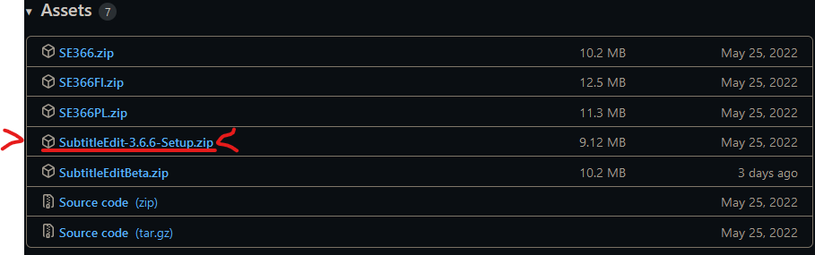
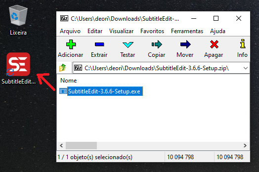
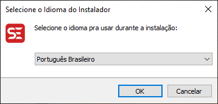
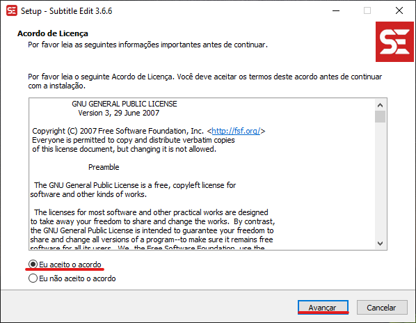
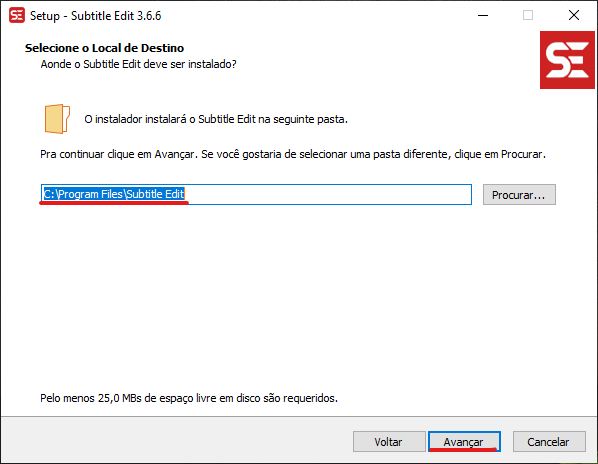
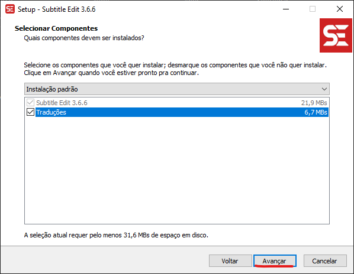
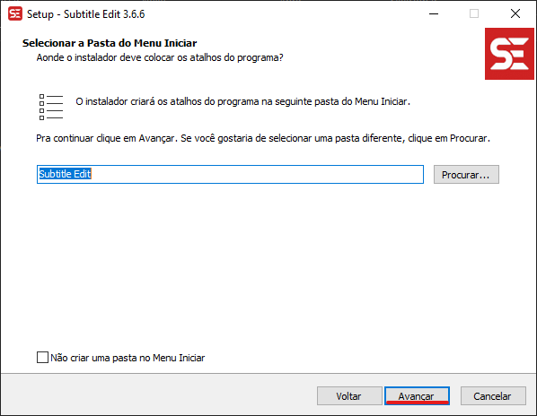
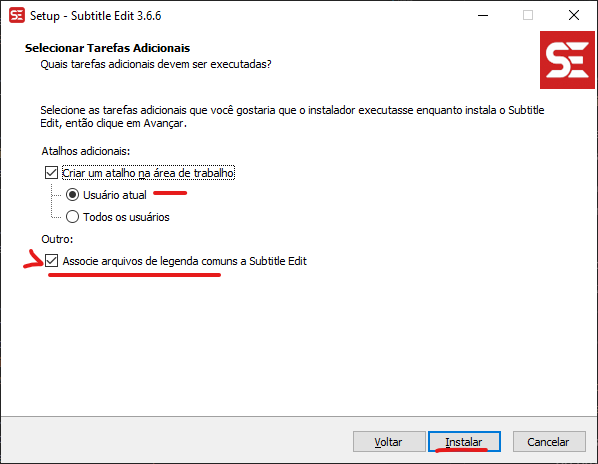
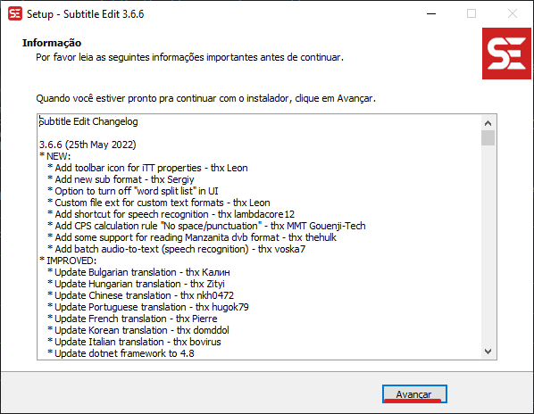
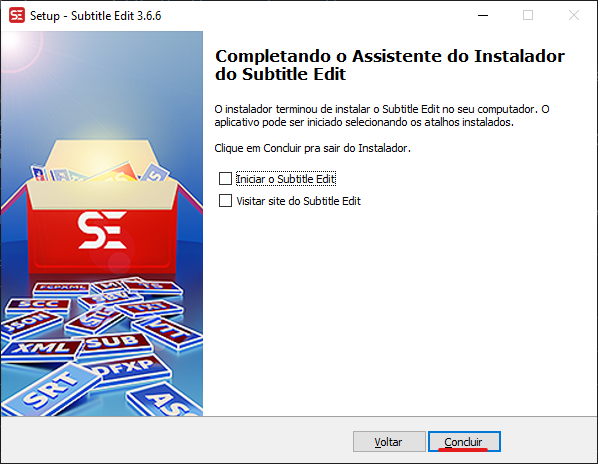

# Instalação Subtitle edit - Windows
Essa parte do manual engloba o procedimento para a instalação do programa no ambiente Windows.

## Download
Se estiver instalando no Windows, primeiro você deve procurar [nesse link](https://github.com/SubtitleEdit/subtitleedit/releases) informado, a versão mais recente, no momento que estou escrevendo esse manual a versão mais recente é a 3.6.6, observe a imagem abaixo e veja como proceder para baixar a versão Setup:

Um arquivo com o nome de `SubtitleEdit-3.6.6-Setup.zip` será baixado, basta o abrir com o um programa de compactação como 7zip, Winrar ou o de sua preferência e extrair na pasta que desejar, no caso eu extraí na área de trabalho.

## Instalação
Depois de descompactado basta executar o arquivo `SubtitleEdit-3.6.6-Setup.exe`. 

1. caso seja pedida uma autorização para o programa ser executado, basta clicar em `Sim`.

2. Irá aparecer uma tela para selecionar a linguagem, deixe em Português Brasileiro ou selecione a desejada. Clique em `ok` para prosseguir.

3. Aparecerá um "Acordo de licença", leia e decida se vai aceitar, se sim clique no botão `Eu aceito o acordo` e depois clique em `Avançar`.

4. Agora é hora de selecionar o local de instalação caso não queira trocar, basta manter na configuração padrão que é `C:\Program Files\Subtitle Edit`, agora basta clicar em `Avançar`. Caso vá trocar o local clique em `Procurar`, mas tenha certeza do que está fazendo.

5. Depois você terá a opção de selecionar os componentes do programa, sugiro que deixe padrão e basta clicar em `Avançar`.

6. O instalador irá criar um atalho no menu iniciar para você. Basta clicar em `Avançar` também.

7. Aparecerá uma opção para selecionar tarefas adicionais, sugiro que clique em `Criar um atalho na área de trabalho` para o `Usuário Atual`, e em `Outro`, clique em `Associe arquivos de legenda comuns a Subtitle Edit`, dessa forma os arquivos de legenda abrirão diretamente com o programa para edição. Então basta clicar em `Instalar`.

8. Ao final da instalação aparecerá uma tela que contém o changelog da versão, é importante para saber os bugs que foram arrumados e as mudanças que foram feitas, depois de ler basta clicar em `Avançar`.

9. Por fim a última tela te oferece a opção de `Iniciar o Subtitle Edit` e `Visitar site do Subtitle Edit`, marque o que quiser fazer e caso não queira fazer nada no momento deixe desmarcado, clique em `Concluir` para encerrar o processo de instalação.

Pronto, após isso o programa pode ser iniciado e configurado. Para acessar o tutorial de configuração, clique [aqui](../../configuracao/README.md)
