# Manual de operação Subtitle Edit
## Tradução automática
O Subtitle Edit vem com a função de tradução automática através do google translate.

1. Para isso basta abrir o arquivo de tradução na aba `File`, depois `Open`, selecionar a legenda desejada, depois ir na aba `Auto-translate` e clicar em `Auto-translate`.

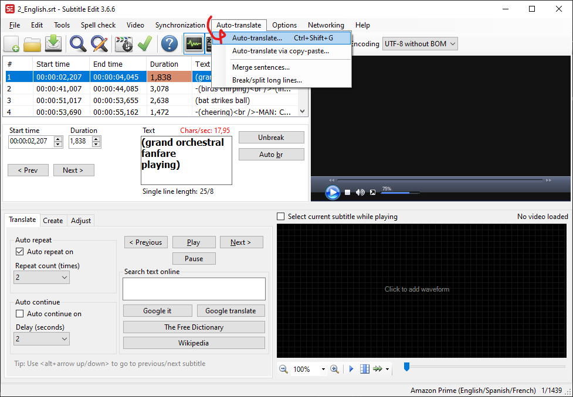

2. Após isso irá abrir uma janela, repare que existe uma lista suspensa com nome de `Service` e selecionado o único serviço disponível `Google Translate V1 API`, aí é onde deve colocar o serviço de tradução desejado.
Existe outras duas listas suspensas chamadas de `From` e `To`, aqui você deve selecionar a língua de origem `From`, e a língua destino `To`, no exemplo abaixo, a imagem representa uma tradução feita do inglês para o Portugues.
Quando tudo estiver configurado da forma correta, basta clicar em `Translate`.

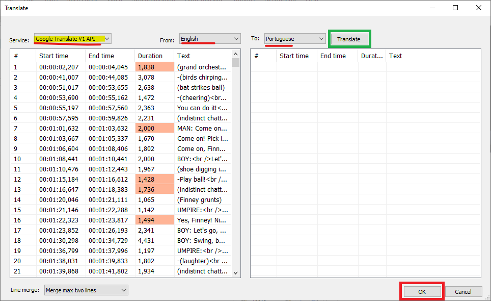

3. Ao começar a tradução aparecerá um aviso dizendo que a tradução será feita no serviço público do google translate, tudo bem basta apertar `OK` para prosseguir e caso não queira mais ver esta mensagem basta clicar em `Don't display this message again`.

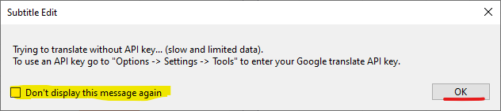

4. Após isso o processo irá começar e uma barra de progresso irá aparecer na tela e um botão `Cancel`, caso queira cancelar a tradução em um certo ponto, a tradução já feita não será descartada, o progresso será mantido até a última linha traduzida. Para salvar as alterações feitas basta clicar em `OK` na parte inferior.

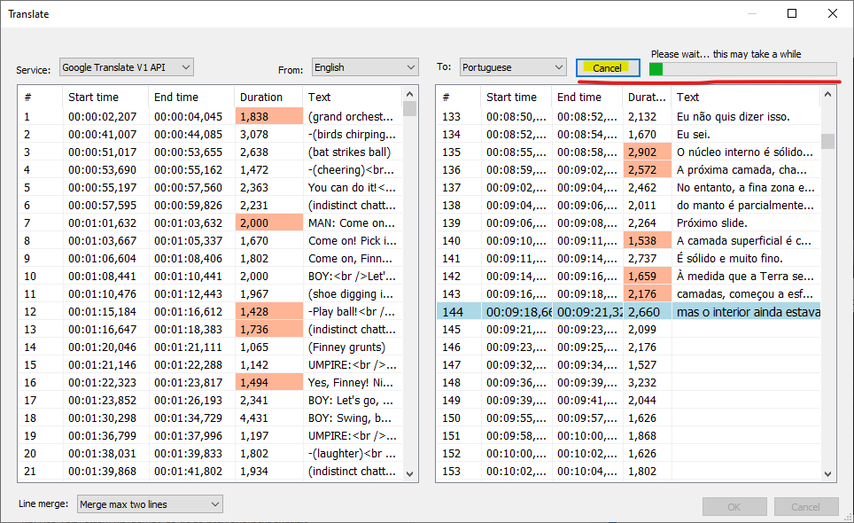

## Ajustando erros comuns de tradução
Depois de realizar a autotradução você pode se deparar com alguns erros comuns, felizmente o subtitle edit possui uma ferramenta que pode corrigir esses erros.

1. Prossiga até a aba `Tool` e navegue pelo menu até `Fix common errors`.

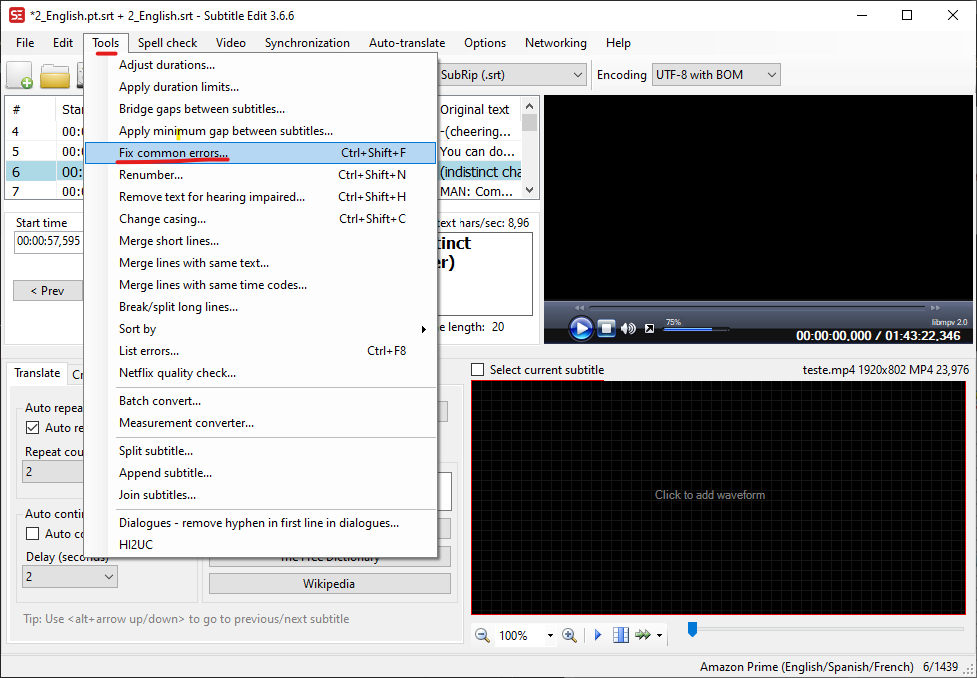

2. Um menu será aberto com vários problemas a serem selecionados, primeira coisa cheque se o menu suspenso `Language` apresenta a linguagem correta a ser corrigida, agora basta selecionar as opções a serem corrigidas, recomendo não selecionar tudo, e principalmente se ainda não estiver habituado ao programa utilize as configurações padrão. Caso tenha mexido nas seleções e queira voltar às definições padrão utilize o botão `Select default`.
Quando tudo estiver configurado corretamente, clique em `Next`.

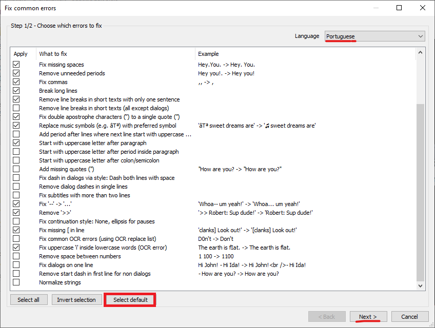

3. O programa não aplicará as correções logo em seguida, aparecerá na janela uma tabela com todas as correções feitas na tradução, com uma coluna de descrição do que foi corrigido chamada de `Function`, antes e depois `Before`, `After`, utilize dessas informações para garantir que o programa atuou corretamente.

    Na primeira coluna `Apply` você pode escolher quais correções serão aplicadas. Por padrão, todas as correções vem marcadas, para marcar uma por uma você pode clicar em `Select all` e depois em `Invert selection`. Você também pode recarregar as correções disponíveis clicando em `Refresh available`

    Você tem a opção de mexer nos tempos da tradução em `Start time` e `Duration`, mas tenha atenção para não sobrescrever legendas.

    Outra função são os botões `Auto br` que faz com que quebras de linha sejam aplicadas onde a tag ` ` está presente. Por outro lado você pode Tirar essas quebras de linha clicando em `Unbreak`.

    Se tudo estiver em ordem basta clicar em `Apply selected fixes` para aplicar as correções e depois em `OK` para finalizar.

    Existe uma aba de log na página que mostra de uma forma diferente as alterações feitas pelo programa, basta clicar em Log.

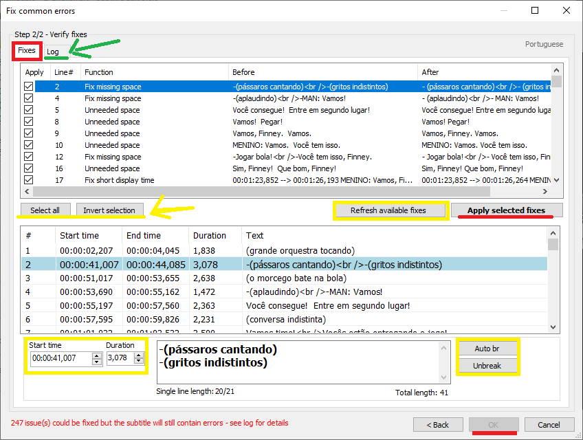

## Revisando uma legenda autotraduzida
Para fazer uma boa revisão de legenda você deve seguir alguns passos:

1. Ao selecionar um perfil nas opções, no caso desse manual o perfil Amazon você está mudando a regra de como o programa trata as legendas. Para identificar partes da legenda que estão em desacordo com a regra do perfil basta olhar na planilha de legenda células marcadas em vermelho.

Para verificar qual o erro daquela metragem da legenda basta olhar nas caixas de texto `Text` e `Original Text`, nelas serão apresentados em letras vermelhas os descumprimentos dessas regras. Por exemplo:

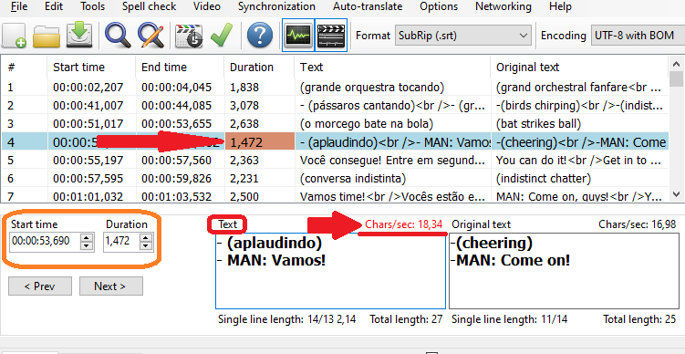

Nessa legenda o número de caracteres por segundo a ser lido é 18,34, muitos caracteres para serem lidos num curto espaço de tempo. O que pode ser feito são duas coisas básicas, adaptar a tradução dentro da caixa de texto `Text` ou mexer no tempo de início e no tempo de duração da legenda em `Start time` e `Duration` para atingir uma média de 17 caracteres por segundo.

Atenção no último método para não finalizar uma legenda depois do tempo de início de outra, isso gerará outro erro que precisa ser consertado com esse método. Tente adaptar e mexer o mínimo possível nos tempos **Keep it simple**. Exemplo básico:

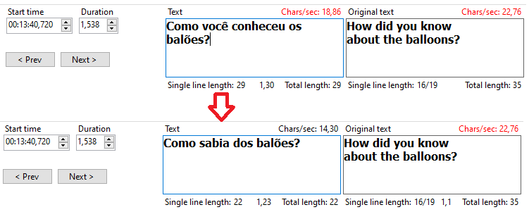

2. O programa vem com algumas ferramentas para manipular a junção e divisão de linhas de legendas muito grandes.

- Split: Divide uma linha em duas. Muito útil em uma linha com muitos caracteres que não foi possível adaptar e que tem bastante espaço em volta para retrabalhar os tempos de início e fim.

- Merge with line before: Une a linha selecionada à linha anterior. Talvez seja útil em linhas pequenas que estejam se sobrepondo.

- Merge with line after: Une a linha selecionada à próxima linha. O mesmo da de cima mas para próxima linha.

- Extend to line before: Une a duração da linha até o limite da linha anterior. Pode ser útil para linhas que se tem um espaço para trabalhar em volta, e que a adaptação não conseguiu atingir um nível adequado de entendimento. Usado para extender o tempo na tela até os limites máximos sem sobrepor.

- Extend to line after: Une a duração da linha até o limite da próxima linha. O mesmo de cima mas para a linha posterior.

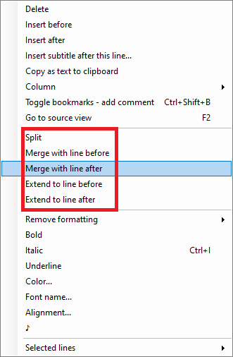

## Ferramentas de visualização
1. Existem diversas formas de se visualizar o tempo e espaço da legenda na tela. A forma mais intuitiva é simplesmente ir na planilha de legenda e clicar duas vezes sobre alguma delas, isso levará você ao seu ponto de  do áudio e do vídeo que está clicando. Repare abaixo:

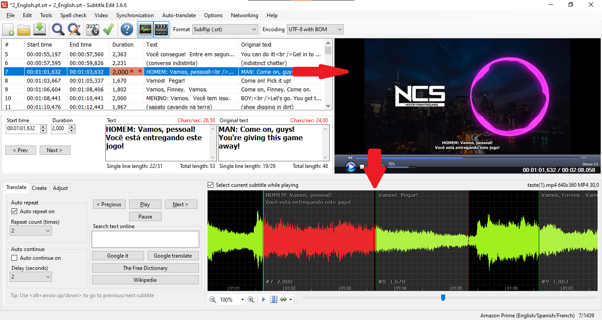

Na imagem acime é possível ver que o vídeo e a waveform, do áudio foi para a minutagem que a legenda começa.

Isso facilita para visualizar se a legenda está alinhada no vídeo e no áudio. Visualizar as ondas sonoras do áudio é muito importante pois pode ajudar a identificar quando um ator começa a falar e melhorar a sincronia. Mais a frente falarei como gerar essas ondas de áudio. É importante notar também que o vídeo está pausado quando se clica.

2. Outras duas ferramentas importantes são, `Prev` e `Next` perto das caixas de texto. Eles servem para ir para a legenda anterior e a próxima respectivamente, porém essas ferramentas não sincronizam o vídeo junto servem apenas para percorrer a planilha.

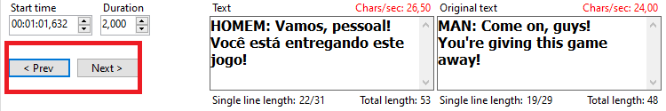

3. Logo abaixo na aba translate é possível ver 4 botões: 

- `< Previous` Volta a legenda anterior
- `Next >` Vai a próxima legenda 
- `Pause` Pausa o vídeo/áudio
- `Play` Retoma o vídeo/áudio

A diferença aqui é que ao clicar em `Next >` e `< Previous` a legenda pulará para a próxima na planilha e também no vídeo/áudio, esse também começará a tocar imediatamente.

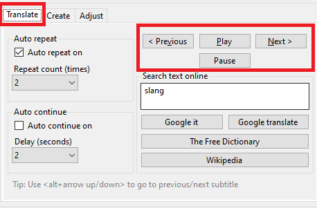

### Waveform - Visualização de áudio

É possível trazer a visualização de áudio para dentro do programa, para isto basta clicar na parte da tela escrita `Click to add waveform`, e o programa começará a criar as formas do áudio, o processo pode demorar pouco ou muito, varia de acordo com a velocidade do hardware, pelo tamanho do arquivo de áudio, qualidade, duração, tenha ciência que realmente irá demorar e caso queira você pode cancelar sem perdas ao seu projeto, porém não receberá resultado nenhum se cancelar, mesmo das ondas já desenhadas.

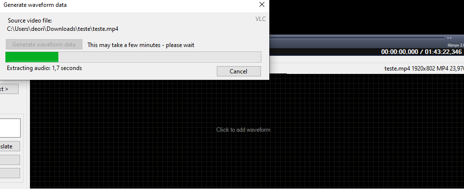

Esse recurso é ótimo para criar novas legendas ou para ressincronizar legendas com falas dos atores ou descrições de sons de ambiente, já que é possível visualizar onde começa e onde termina o som.

Com esse recurso ativo você pode simplesmente arrastar o tempo de duração das legendas usando os cursores que aparecerão sobre a forma do áudio, e assim ajustar da melhor forma possível de maneira bem eficiente, já que não precisará ficar conferindo a todo momento se você advinhou onde começa a fala. Existem as abas `Create` e `Adjust` que ajudarão ainda mais na sincronia, observe:

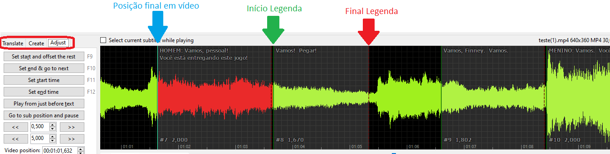
